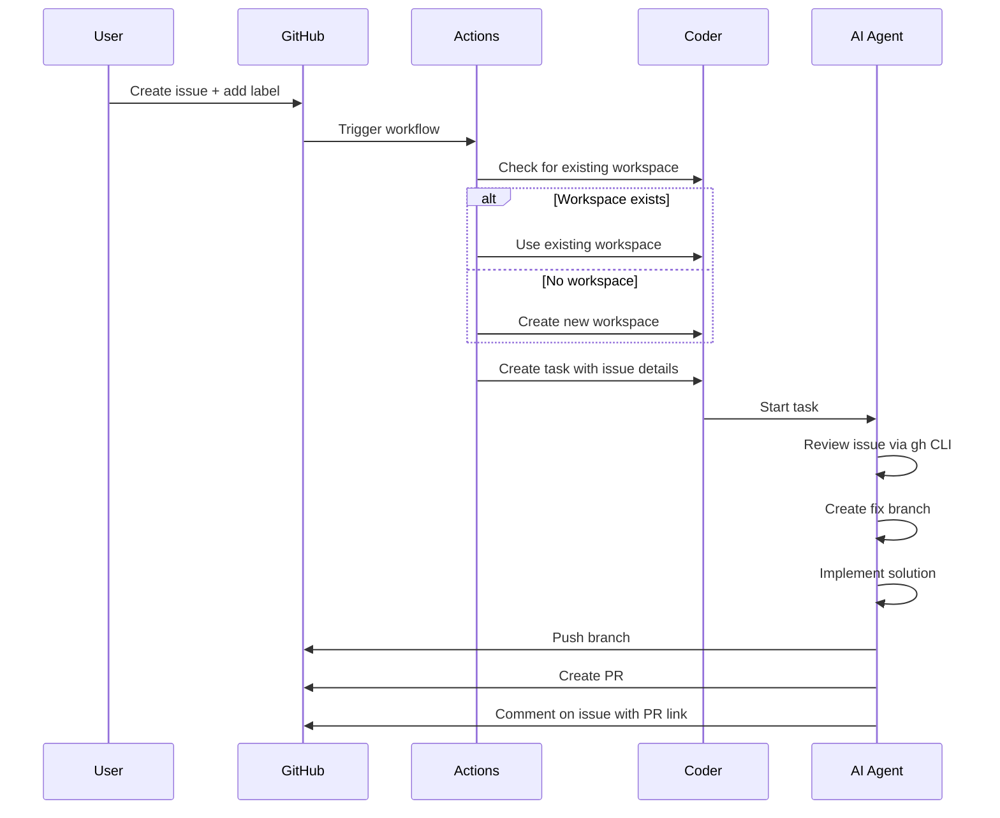

# Coder Issue Automation

Automatically dispatch GitHub issues to AI coding agents running in Coder workspaces.

## Overview

This automation allows you to:
1. Create a GitHub issue describing a bug or feature
2. Label it with `coder-claude`, `coder-codex`, or `coder-gemini`
3. Have an AI agent automatically work on fixing the issue
4. Get a pull request created and linked back to the issue

## How It Works



## Setup

### 1. Copy Workflow to Your Repository

Copy `.github/workflows/coder-issue-automation.yaml` from this repository to your target repository.

You can do this automatically with:

```bash
# In your target repository
mkdir -p .github/workflows
curl -o .github/workflows/coder-issue-automation.yaml \
  https://raw.githubusercontent.com/nyc-design/Coder-Workspaces/main/.github/workflows/coder-issue-automation.yaml
```

### 2. Configure GitHub Secrets

Add these secrets to your repository (Settings → Secrets and variables → Actions):

| Secret Name | Description | How to Get |
|-------------|-------------|------------|
| `CODER_URL` | Your Coder deployment URL | e.g., `https://coder.example.com` |
| `CODER_SESSION_TOKEN` | Long-lived Coder session token | Run: `coder token create --lifetime 8760h --name "GitHub Actions"` |

### 3. Create Issue Labels

Create these labels in your repository (Settings → Labels):

- `coder-claude` - Dispatch to Claude Code agent
- `coder-codex` - Dispatch to OpenAI Codex agent
- `coder-gemini` - Dispatch to Google Gemini agent

Suggested colors:
- `coder-claude`: `#7B5AFF` (purple)
- `coder-codex`: `#10A37F` (green)
- `coder-gemini`: `#4285F4` (blue)

## Usage

### Basic Usage

1. **Create an issue** describing the bug or feature
2. **Add a label**: Choose `coder-claude`, `coder-codex`, or `coder-gemini`
3. **Wait for automation**: The workflow will:
   - Find or create a Coder workspace
   - Dispatch a task to the AI agent
   - Post a confirmation comment
4. **Review the PR**: The AI agent will create a PR and link it in the issue

### Example Issue

**Title:** Fix null pointer exception in user authentication

**Body:**
```markdown
When a user tries to log in with an empty email field, the application crashes with a null pointer exception.

Steps to reproduce:
1. Go to /login
2. Leave email field empty
3. Click "Login"
4. App crashes

Expected: Show validation error message
Actual: Application crashes

Stack trace:
[paste stack trace here]
```

**Label:** `coder-claude`

The AI agent will:
- Read the issue using `gh issue view`
- Locate the authentication code
- Add null checking and validation
- Create a PR with the fix

## Technical Details

### How Workspace Matching Works

The workflow uses a parameter-based matching algorithm:

```bash
# 1. List all workspaces with the template
WORKSPACES=$(coder ls --output json | \
  jq -r '.[] | select(.template_name == "repo-envbuilder-agent") | .name')

# 2. For each workspace, get its parameters
WS_DETAILS=$(coder show "$ws_name" --output json)

# 3. Extract repo_name and coding_agent parameters
WS_REPO=$(echo "$WS_DETAILS" | \
  jq -r '.latest_build.template_variables[] | select(.name == "repo_name") | .value')
WS_AGENT=$(echo "$WS_DETAILS" | \
  jq -r '.latest_build.template_variables[] | select(.name == "coding_agent") | .value')

# 4. Match if both repo and agent match
if [ "$WS_REPO" = "$REPO_NAME" ] && [ "$WS_AGENT" = "$AGENT_TYPE" ]; then
  # Use this workspace
fi
```

This approach is reliable because:
- It doesn't depend on workspace naming conventions
- It checks the actual template parameters
- It ensures the correct agent is already configured
- It prevents duplicate workspaces for the same repo/agent combo

## Workflow Details

### Workspace Selection

The workflow intelligently reuses existing workspaces by checking their parameters:

1. **List** all workspaces using the `repo-envbuilder-agent` template
2. **Inspect** each workspace's parameters (`repo_name` and `coding_agent`)
3. **Match** when both the repository name AND agent type match
4. **Start** if stopped, or **create** if no match found

This ensures you don't create duplicate workspaces for the same repo/agent combination, even if they have different names.

### Task Creation

The AI agent receives detailed instructions:

```
🤖 Automated Issue Assignment

You are working autonomously on GitHub issue #123: "Fix bug in..."

IMPORTANT INSTRUCTIONS:
1. You are working WITHOUT immediate user feedback
2. Use 'gh issue view 123' to read the full issue
3. Create a new branch: git checkout -b fix/issue-123
4. Make the necessary code changes
5. Commit with clear messages
6. Push the branch
7. Create a PR with gh pr create
8. Comment on the issue with the PR link
```

### Security Considerations

- The workflow uses your Coder session token to create/manage workspaces
- AI agents work in isolated Coder workspaces with their own credentials
- Each workspace has access to the repository via GitHub authentication
- Tokens are stored as GitHub secrets and never exposed in logs

## Customization

### Modify Workspace Template

Edit the workflow to use a different Coder template:

```yaml
coder create "$WORKSPACE_NAME" \
  --template "your-custom-template" \  # Change this
  --parameter "repo_name=${REPO_NAME}" \
  --yes
```

### Adjust Task Instructions

Modify the task prompt in the workflow to change AI agent behavior:

```yaml
TASK_PROMPT=$(cat <<EOF
  Your custom instructions here...
EOF
)
```

### Add More Agents

To support additional AI agents:

1. Add label to the condition:
   ```yaml
   if: |
     contains(github.event.label.name, 'coder-') &&
     (github.event.label.name == 'coder-claude' ||
      github.event.label.name == 'coder-codex' ||
      github.event.label.name == 'coder-gemini' ||
      github.event.label.name == 'coder-your-agent')  # Add here
   ```

2. Update your workspace template to support the new agent

## Troubleshooting

### Issue: Workflow doesn't trigger

**Check:**
- Label name exactly matches (case-sensitive)
- Workflow file is in `.github/workflows/`
- Workflow has `issues` permissions

### Issue: Workspace creation fails

**Check:**
- `CODER_SESSION_TOKEN` is valid (not expired)
- `CODER_URL` is correct and accessible
- Template `repo-envbuilder-agent` exists in your Coder deployment
- Required parameters match your template

### Issue: AI agent doesn't create PR

**Check:**
- Agent has GitHub authentication configured
- Repository permissions allow PR creation
- Issue description is clear and actionable
- Review Coder workspace logs for errors

### Issue: Task creation fails

**Check:**
- Workspace is running (`coder ls`)
- Workspace has the AI agent properly configured
- `coder tasks create` command works manually

## Advanced: Multi-Repository Setup

To enable this across all your repositories:

### Option 1: Copy to Each Repo

Use a script to copy the workflow to multiple repos:

```bash
#!/bin/bash
REPOS=("repo1" "repo2" "repo3")
WORKFLOW_URL="https://raw.githubusercontent.com/nyc-design/Coder-Workspaces/main/.github/workflows/coder-issue-automation.yaml"

for repo in "${REPOS[@]}"; do
  cd "$repo"
  mkdir -p .github/workflows
  curl -o .github/workflows/coder-issue-automation.yaml "$WORKFLOW_URL"
  git add .github/workflows/coder-issue-automation.yaml
  git commit -m "Add Coder issue automation"
  git push
  cd ..
done
```

### Option 2: Organization-Wide Workflow

Create this as a reusable workflow in a central repository and call it from other repos.

## Monitoring and Metrics

Track automation effectiveness:

- **Success Rate**: PRs created vs issues labeled
- **Time to PR**: Duration from label to PR creation
- **Code Quality**: PR review comments, test pass rate
- **Issue Resolution**: Time from issue to merged PR

Monitor in Coder dashboard:
- Active workspaces created by automation
- Task completion rates
- Resource usage per agent type

## Best Practices

### Writing Good Issues for AI Agents

1. **Be Specific**: Clear reproduction steps, expected vs actual behavior
2. **Provide Context**: Stack traces, error messages, relevant code snippets
3. **Set Scope**: One issue = one logical fix
4. **Add Examples**: Sample inputs/outputs, test cases

### Choosing the Right Agent

- **Claude Code** (`coder-claude`): Best for complex refactoring, architectural changes
- **Codex** (`coder-codex`): Good for straightforward bug fixes, incremental features
- **Gemini** (`coder-gemini`): Strong at understanding context, documentation tasks

### Review Before Merge

Always review AI-generated PRs:
- Verify the fix addresses the root cause
- Check for edge cases
- Ensure tests are added/updated
- Validate no unintended changes

## Examples

### Bug Fix Example

**Issue #42**: "API returns 500 error when user ID is null"

**Label**: `coder-claude`

**Result**: PR with null checking, error handling, and unit tests

### Feature Example

**Issue #99**: "Add pagination to user list endpoint"

**Label**: `coder-codex`

**Result**: PR with pagination parameters, updated docs, integration tests

### Refactoring Example

**Issue #156**: "Extract authentication logic into separate service"

**Label**: `coder-claude`

**Result**: PR with new auth service, updated imports, maintained functionality

## Contributing

To improve this automation:

1. Fork the Coder-Workspaces repository
2. Modify `.github/workflows/coder-issue-automation.yaml`
3. Test in your environment
4. Submit a PR with your improvements

## Support

- **Issues**: [GitHub Issues](https://github.com/nyc-design/Coder-Workspaces/issues)
- **Coder Docs**: [Coder Documentation](https://coder.com/docs)
- **Coder Tasks**: [Tasks Documentation](https://coder.com/docs/tasks)
